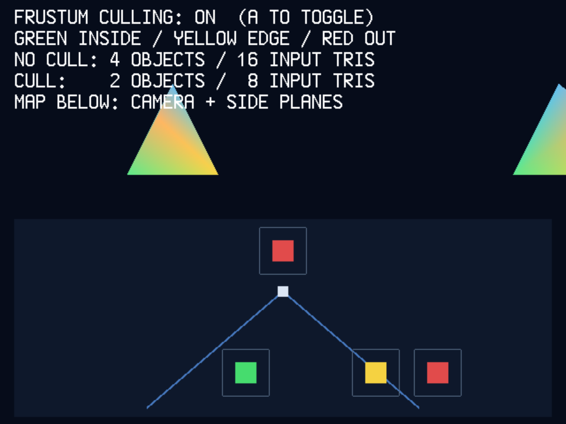

# Advanced example: view-frustum culling

`advanced_examples/10-frustum-culling.cpp` starts in a fixed pose. The upper
view shows the geometry submitted through the existing indexed-mesh API. The
lower map looks down on the camera and its two side planes. Green marks an
inside bound, yellow a bound crossing the right side plane, and red two fully
outside bounds. Press **A** to turn the CPU culling decision off or on; the
scene starts with culling on. The label states both modes' input counts, so
the result can be understood without controller input.

## Predict the fixed frame

The camera is at `(0, 0, 0)`, looking along negative Z, with a 60-degree
vertical field of view, 4:3 aspect, near plane `0.1`, and far plane `20`.
Each tetrahedron has four input triangles and an object-space sphere centered
at its origin with radius `0.75`. The largest vertex distance is about `0.707`,
so this bound encloses the mesh.

| Color and case | Center `(x, y, z)` | Bound result | With culling on |
| --- | --- | --- | --- |
| Green, inside | `(-1.2, 0.9, -4)` | Inside | Submit four triangles |
| Yellow, right edge | `(3, 0.9, -4)` | Intersects | Submit four triangles |
| Red, right outside | `(5, 0.9, -4)` | Outside | Skip the mesh call |
| Red, behind camera | `(0, 0.9, 2)` | Outside | Skip the mesh call |

At depth 4, the right side plane crosses X at about `3.08`. The yellow
sphere reaches across that plane, so its whole mesh must continue to the
existing triangle clipper. A conservative bound may cause extra work, but it
must not remove visible geometry. Camera movement and nonuniform scale are
covered by the portable host test; the displayed pose stays fixed for clear
comparison.

## One frame, from CPU to PVR

1. `classify_sphere()` transforms the bound center, scales its radius by the
   largest absolute object scale, and checks signed distances to six camera
   planes. Boundary contact stays potentially visible. Invalid inputs also
   stay visible rather than silently deleting an object.
2. With culling on, two outside objects skip `RenderList::submit(mesh, ...)`.
   Two objects, or eight input triangles, reach the mesh path. With culling
   off, all four objects, or sixteen input triangles, reach it.
3. The existing mesh path transforms and clips triangles. It already discards
   fully outside triangles before PVR submission. Thus this fixed scene saves
   CPU transform/clip work and two mesh calls; it does **not** establish any
   saved PVR polygon headers or vertex packets for the red objects. Actual
   emitted packets also depend on clipping of the yellow tetrahedron.
4. The opaque list carries a background, map geometry, and surviving mesh
   triangles. One punch-through quad samples a `512x128` ARGB4444 BIOS-font
   label texture (128 KiB of PVR texture memory). The two toggle states use
   two such textures, allocated and uploaded before the frame loop.

The fixed background and map contribute 25 opaque quads: 25 polygon headers,
100 vertex packets, and 125 `pvr_prim()` calls through the existing quad path.
The label adds one punch-through header and four textured vertices. These
source-derived counts exclude mesh triangles, whose emitted packet count can
change when a triangle crosses a clip plane; they are not timing measurements.

The map is a teaching diagram in screen coordinates. Each outlined square
shows the X/Z extent of a bound at the map scale; the filled square marks its
center and classification. These are not additional 3D meshes. PVR winding
culling is a separate polygon-state choice. The example uses the default
no-winding-cull setting.

## Reproduce

~~~sh
make host-test
make in-container TARGET=dreamcast-frustum-culling-cdi DC_BUILD_DIR=build-dreamcast-frustum DC_BUILD_TYPE=Debug
make flycast-frustum-culling DC_BUILD_DIR=build-dreamcast-frustum
~~~

## Verification on 2026-10-05

The pinned image in `tools/toolchain.lock` uses KOS `2.3.0` at commit
`63702a858c17c915b564b378407b1576c78668ec` and GCC `16.2.0`.
`make host-test` passed, and isolated Debug and Release Dreamcast builds linked
`maishuji-frustum-culling.elf`. The Debug CDI booted in Flycast; the checker
passed three stable frames with two visible meshes, the labeled map, and the
guest marker reporting two submitted objects and eight input triangles. The
capture above records that observed frame. These results match the fixed-pose
expectation. The A-button toggle was compiled but not exercised in the
automated emulator check. Physical Dreamcast behavior and CPU timing remain
unverified.

The source baseline is the current `maishuji::Mesh` six-plane clipping path
documented in [meshes.md](meshes.md), plus the view/projection conventions in
[spatial-math.md](spatial-math.md). The host test checks the portable sphere
decision; a target build checks the pinned KOS ABI; Flycast checks the fixed
rendered map and guest completion marker. Neither host arithmetic nor Flycast
measures SH-4 time or proves behavior on a physical Dreamcast.
